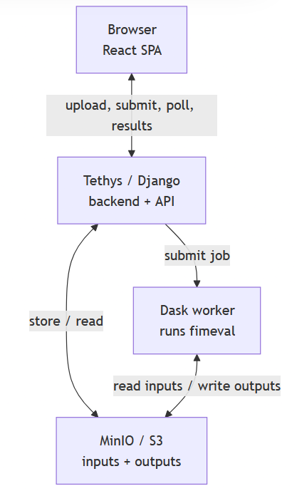

# FIMeval GUI

A React-based single-page application (SPA) for **evaluating Flood Inundation Maps (FIMs)**, integrated with the **Tethys Platform** backend. Users upload a benchmark FIM and one or more candidate FIMs, choose an evaluation method, and receive agreement metrics (CSI, POD, FAR, F1, MCC, …), contingency maps, and downloadable results — computed asynchronously on a Dask cluster via the [FIMeval](https://github.com/sdmlua/fimeval) library.

---

## Architecture Overview

<p align="center">
  
</p>

This is a Tethys Platform 4 (Django-based) backend serving a React/TypeScript SPA built with Vite. The backend exposes a catch-all route that renders the SPA shell, plus a set of JSON API endpoints for uploads, job submission, status polling, and results. Evaluation runs asynchronously: the backend submits a Dask job, a worker downloads the inputs from MinIO/S3, runs `fimeval.EvaluateFIM`, uploads the results back, and writes a terminal `_SUCCESS`/`_FAILED` marker that the status endpoint keys off of. The app requires login (Tethys auth); all inputs and outputs live in S3-compatible object storage, and there is no domain database or ORM beyond Tethys's own job records.

---

## Current Status

This is pre-release software developed for CIROH. **v1.0.0** — all five evaluation methods work end-to-end. A few things worth knowing:

1. **Large uploads are slow and can time out.** Files stream from the browser through Django to MinIO synchronously; on the dev server, large rasters can hit `ERR_EMPTY_RESPONSE`. A migration to presigned **direct-to-MinIO** uploads is planned to retire this bottleneck.
2. **An AOI boundary must overlap the benchmark.** If the supplied AOI polygon falls outside the benchmark's data extent, the clip is empty and the run fails with a cryptic GDAL message. A clear *"AOI does not overlap the benchmark extent"* message is planned.
3. **The target CRS is hardcoded to EPSG:5070** (CONUS Albers). Mixed-CRS inputs are reprojected to it automatically, but non-CONUS study areas will need a user-selectable target CRS.
4. **Not yet hardened for many concurrent users.** A single Dask scheduler, synchronous uploads, and no per-user quotas or output cleanup mean heavy parallel use needs the hardening described in the [Roadmap](#roadmap).
5. **The frontend ships as a single bundle.** Tethys's catch-all SPA route cannot serve code-split chunks, so the build is intentionally not code-split.

---

## Features

### Upload

- Drag-and-drop or browse for the **benchmark** (single) and **candidate** raster(s) (multiple), with `.tif` / `.tiff` filtering and removable file chips
- **Method** dropdown — Smallest Extent, Convex Hull, Intersection, Bootstrap, AOI
- **AOI mode** reveals a multi-file **shapefile picker**; the run button stays disabled until a `.shp` is present (with an inline hint)
- Chains upload → job submission with an in-flight spinner and an error banner on failure

### Running

- Polls job status every 3 seconds
- Advances to Results on completion; shows an **error screen** on failure (no infinite spinner)
- Completion is detected via a worker-written `_SUCCESS` / `_FAILED` marker in object storage — reliable even in dev, where the Tethys job monitor doesn't tick

### Results

- **Headline metric cards** — CSI, POD, FAR
- **Full metrics table** per candidate — CSI, POD, FAR, F1, MCC, Kappa, Accuracy, TP/FP/FN/TN, TPR/FNR/FPR, precision, sensitivity, wet-to-dry ratio
- **Bootstrap distribution box plots** (ECharts) — shown **only** for the Bootstrap method, visualizing the spread/uncertainty of each metric across resampling iterations (box = IQR, whiskers = 1.5×IQR, points = outliers)
- **Download Results (.zip)** for the full output set, plus individual per-file downloads

---

## Evaluation Methods

All methods produce the same metrics; they differ in **how the evaluation area is defined**. Only **AOI** requires a user-supplied boundary.

| Method | Evaluation area | Needs a shapefile? |
|--------|-----------------|--------------------|
| **Smallest Extent** | Bounding box of the smallest input raster | No |
| **Convex Hull** | Convex hull of the flooded pixels | No |
| **Intersection** (`intersected_extent`) | Overlap of the benchmark + candidate valid-data footprints | No |
| **Bootstrap** | Intersected extent, sampled (`n_points=500` × `n_iterations=100`, random sub-method) to produce a metric **distribution** | No |
| **AOI** | A user-supplied boundary polygon | **Yes** — a shapefile bundle that must overlap the benchmark |

> Bootstrap is the only method whose Results page shows box plots. Its headline numbers match Intersection; the distribution (the uncertainty spread) is the added value.

---

## Inputs & Outputs

**Inputs**

- A **benchmark** raster (GeoTIFF) and one or more **candidate** rasters (GeoTIFF)
- For **AOI** only: a **shapefile bundle** (`.shp` + `.shx` + `.dbf` + `.prj`, plus optional `.cpg`/`.sbn`/…) that overlaps the benchmark
- Mixed CRSs are allowed — fimeval reprojects everything to a common CRS (EPSG:5070) and masks permanent water bodies

**Outputs** (per job, in object storage):

```
uploads/<user_id>/<upload_id>/         benchmark.tif · candidate_<n>.tif · [boundary/<shapefile parts>]
outputs/<user_id>/<upload_id>/
    ├── _SUCCESS | _FAILED                         terminal marker (drives status; hidden from downloads)
    └── case_study/<method>/
        ├── EvaluationMetrics/EvaluationMetrics.csv
        ├── ContingencyMaps/ContingencyMAP_<candidate>.tif
        ├── MaskedFIMwithBoundary/<*_clipped>.tif
        ├── BoundaryforEvaluation/FIMEvaluatedExtent.*   (auto-extent methods only — not AOI)
        └── Random_Sampling/random_<candidate>.csv       (Bootstrap only)
```

### API endpoints

All under `/apps/fimeval-gui/api/` (login required except `csrf`):

| Path | Purpose |
|------|---------|
| `POST /upload/` | Upload benchmark + candidates (+ optional AOI `boundary` bundle) → `upload_id` |
| `POST /jobs/` | Submit a job `{upload_id, method}` → `job_id` |
| `GET  /jobs/<id>/` | Job status (`submitted` / `running` / `complete` / `error`) |
| `GET  /jobs/<id>/outputs/` | List output files |
| `GET  /jobs/<id>/metrics/` | Parsed `EvaluationMetrics.csv` |
| `GET  /jobs/<id>/bootstrap/` | Bootstrap distribution as box-plot stats (bootstrap jobs only) |
| `GET  /jobs/<id>/download/?file=<key>` | Download one output (303 → presigned URL) |
| `GET  /jobs/<id>/download-all/` | Download all outputs as a ZIP |

---

## Prerequisites

This application runs on:

- **Tethys Platform 4** (Django-based), installed into a conda environment using the libmamba solver
- **Node.js** (current LTS) and **Vite** for the React / TypeScript frontend
- A **Dask** scheduler and a **bounded worker pool** (each worker process must have
  [`fimeval`](https://pypi.org/project/fimeval/) ≥ 0.1.64 installed):

  ```bash
  dask scheduler --port 8786
  # Env-configurable; the defaults reproduce the 2-worker / 6 GB pool.
  # Size it to your host with docs/specs/worker-sizing-guide.md.
  ./tethysapp/fimeval_gui/scripts/start_worker.sh
  ```

  `--nworkers 2 --nthreads 1` runs each job in its own process (no GIL contention)
  and queues everything beyond two concurrent jobs — heavy evaluations peak at
  ~4.5 GB each, so an unbounded shared worker OOMs at 3+ concurrent heavy jobs
  (see `docs/specs/perf-profiling-findings.md` and
  `docs/specs/desktop-app-comparison-findings.md`). `--memory-limit 6GB` keeps a
  4.5 GB peak below Dask's ~80 % pause threshold while letting the nanny restart
  a truly runaway worker. Scale `--nworkers` with available RAM
  (≈ 6 GB per worker + headroom for the web server). The wrapper also exports
  `PROJ_NETWORK=OFF` (reprojections need no downloadable PROJ grids, so they
  shouldn't depend on a CDN that can fail transiently under load) and
  `PYTHONUNBUFFERED=1` (streams fimeval's progress/error output live instead of
  buffering it until the worker exits).

  > Sizing the pool for your host (RAM → worker count / memory), including the
  > dev-vs-separate-host topology: see
  > [`docs/specs/worker-sizing-guide.md`](docs/specs/worker-sizing-guide.md).
- **S3-compatible object storage** — a local **MinIO** instance on port 9000 (or AWS S3) for inputs and outputs
- **ECharts** for the Bootstrap distribution charts (frontend dependency)

### Configuration (Tethys app settings)

| Setting | Example | Notes |
|---------|---------|-------|
| `minio_endpoint_url` | `http://127.0.0.1:9000/` | Required for MinIO; leave blank for real AWS S3 |
| `s3_public_endpoint_url` | *(blank)* | Browser-facing object-storage URL for presigned upload/download URLs. Leave blank to reuse the server storage endpoint (correct for local dev); set in production when the browser reaches storage at a different host than the server does |
| `minio_access_key` / `minio_secret_key` | `admin` / `admin123` | Object-storage credentials |
| `s3_bucket` | `fimeval` | Bucket name (must exist) |
| `dask_primary` (Scheduler setting) | `tcp://127.0.0.1:8786` | Dask scheduler host — note the `tcp://` scheme, not http |

#### Browser uploads & MinIO CORS

Uploads use **presigned PUT URLs**: the browser sends file bytes directly to
MinIO instead of streaming them through the web server (this keeps the server's
memory flat and removes it as an upload bottleneck). A direct browser PUT is a
cross-origin request, so MinIO must allow CORS from the app origin.

- **Local dev:** nothing to do. MinIO's `cors_allow_origin` defaults to `*`, so
  the browser PUT works out of the box.
- **Production / hardened setups:** scope that `*` down to your real origins with
  [`scripts/setup_minio_cors.sh`](tethysapp/fimeval_gui/scripts/setup_minio_cors.sh).
  MinIO does **not** support the S3 per-bucket `PutBucketCors` API — CORS is a
  server-level setting applied via `mc admin config` (the script handles it and
  restarts the service).

| Service | Port | | Service | Port |
|---------|------|---|---------|------|
| Tethys/Django | 8000 | | MinIO | 9000 |
| Vite dev server | 5173 | | Dask scheduler | 8786 |

---

## Project Structure

```
tethysapp-fimeval-gui/
├── reactapp/                              # Vite + React/TypeScript frontend
│   └── src/
│       ├── App.tsx                        # Root: three-step wizard state
│       ├── api.ts                         # API client
│       ├── UploadStep.tsx                 # Upload + method + AOI shapefile picker
│       ├── RunningStep.tsx                # Status polling
│       ├── ResultsStep.tsx                # Metrics, downloads, box-plot panel
│       ├── BootstrapBoxPlots.tsx          # ECharts box plots (Bootstrap)
│       ├── Dropzone.tsx / ErrorBoundary.tsx
│       └── Stepper.tsx
└── tethysapp/fimeval_gui/
    ├── app.py                             # TethysAppBase config + settings (MinIO, scheduler)
    ├── controllers.py                     # SPA route + API endpoints
    ├── storage.py                         # S3 / MinIO wrapper
    ├── job_types/evaluate_fim.py          # Dask task → fimeval.EvaluateFIM (+ _SUCCESS/_FAILED marker)
    ├── tests/                             # Backend tests (moto-mocked)
    └── public/frontend/                   # Vite build output (generated)
```

---

## Roadmap

Upcoming work, in rough priority order:

1. **Presigned direct-to-MinIO uploads** — retire the slow synchronous upload path so large rasters upload reliably
2. **Friendly AOI-overlap error** — surface a clear message when the AOI doesn't overlap the benchmark, instead of the raw GDAL error
3. **Selectable target CRS** — support non-CONUS study areas rather than hardcoding EPSG:5070
4. **Multi-user hardening** — input-size limits, per-user job quotas, output lifecycle/cleanup, and Dask worker-pool sizing for safe parallel use

---

## Proposed Future Versions

v1.0.0 delivers the core evaluation pipeline — all five extent methods (Smallest Extent, Convex Hull, Intersection, AOI, Bootstrap), single-case-study uploads, metrics, contingency maps, and downloads. The capabilities below build on that foundation; the pluggable job-type architecture means each can be added without disturbing the existing pipeline:

- **Multi-case-study uploads** — support fimeval's directory-of-folders structure to evaluate several case studies in one submission.
- **Inline result visuals** — render fimeval's `PrintContingencyMap` and `PlotEvaluationMetrics` PNGs directly in the Results view (today the metrics table + Bootstrap box plots are shown; the contingency raster is download-only).
- **Building-footprint evaluation** — `EvaluationWithBuildingFootprint`, using Microsoft's default footprints with an option to upload custom ones.
- **Benchmark catalog browser** — `benchFIMquery`: let users pull a benchmark from a server-side catalog instead of uploading one (à la FIMbench).
- **Interactive map exploration** — convert contingency rasters to Cloud-Optimized GeoTIFFs (COGs) and serve them as tiles for a MapLibre overlay: TP/FP/FN/TN/PWB color classes, basemap toggle, side-by-side candidate comparison, and AOI/PWB overlays. This is the largest item (COG pipeline + tile serving + map UI) and would bring FIMeval to the visual polish of FIMbench.

> Results rendering today follows a lightweight **download-and-dashboard** approach (metrics + downloads + box plots). The **interactive map** above is the planned visualization upgrade, layered on the same backend.

---

## Contact

For questions on **FIMeval** (data, methodology, access requests):

- [Dr. Sagy Cohen](mailto:sagy.cohen@ua.edu)
- [Supath Dhital](mailto:sdhital@crimson.ua.edu)
- [Dipsikha Devi](mailto:ddevi@ua.edu)

For questions about how **this web application** works:

- [Reshma Raghavan](mailto:rraghavan@aquaveo.com)
