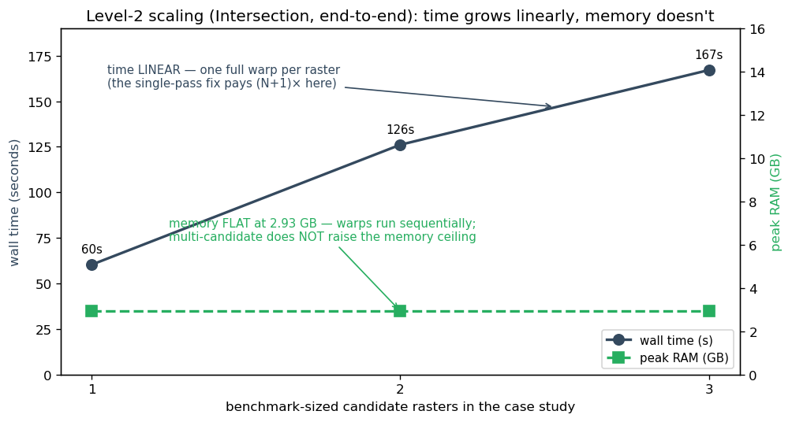

# FIMeval Library Optimization Findings — FIMEVAL-PERF-2

**Question (follow-up to [perf-profiling-findings.md](perf-profiling-findings.md)):**
before provisioning expensive memory-optimized cloud instances, can the heavy
evaluation methods (Intersection, Bootstrap, AOI) be made more efficient? Where
exactly is the computation going?

**Answer, in one line:** the "heavy methods" are not heavy — **89–99.5 % of every
run is shared preprocessing**, dominated by a reproject-at-full-resolution step
whose output is immediately downsampled away. A standard single-pass warp is
**measured 5.2× faster** and also eliminates the ~2.6 GB memory spike, which is
caused by a compression helper reading the full-resolution intermediate into RAM
(twice). With these library fixes, the heavy methods should cost roughly what the
light ones do — likely making memory-optimized (R-family) instances unnecessary.

**Date:** 2026-07-08/09 · fimeval **0.1.64** (pip) / source repo `sdmlua/fimeval`
@ `a64c3d9` · WSL2, 15.6 GiB RAM · profiled via in-memory function wrappers —
**no fimeval source was modified**.

---

## 1. How FIMeval runs (context for the numbers)

Per the FIMeval team: a run is always **one method** over a main directory of
case studies; each case study has one benchmark (`…BM.tif`) and one or more
candidate rasters. The pipeline per case study:

```
EvaluateFIM
 ├─ MakeFIMsUniform            ← reproject all rasters to a common CRS (if mixed),
 │                               then resample all to the coarsest resolution
 ├─ method (intersected_extent / bootstrap / AOI / …)   ← evaluation domain
 ├─ ExtractPWB                 ← fetch permanent water bodies (ArcGIS REST, network)
 └─ per-candidate: align → confusion matrix → metrics
```

## 2. Findings

### F1 — All three "heavy" methods are ~all preprocessing

Full-phase timing on the Tier_1-class dataset (408 MB, 0.5 m benchmark; mixed
CRS, so reprojection triggers). Runs completed end-to-end (metrics produced);
the flaky network PWB step was replaced by a local water-body file and measured
separately (F5).


| Phase | Intersection | Bootstrap | AOI |
|---|--:|--:|--:|
| `MakeFIMsUniform` (preprocess) | **99.2 %** | **89.3 %** | **99.5 %** |
| — of which CRS warp | 84 % | 74 % | 82 % |
| The method itself | 0.3 % | 0.8 % | 0.2 % |
| Bootstrap sampling (100 iters × 500 pts) | — | 9.1 % (5.5 s) | — |
| Wall total | 60.3 s | 60.7 s | 53.4 s |

The intersection geometry, AOI clip, and bootstrap extent are each **< 1 %** of
the run. There is nothing to optimize *in the methods* — the cost is upstream
and shared.

### F2 — The hotspot: warp at full resolution, then throw the detail away

`MakeFIMsUniform` reprojects each raster **at its native resolution**
(`utilis.reprojectFIMs`), producing — for the 0.5 m benchmark — a
**38,515 × 44,482 = 1.71-billion-pixel** intermediate… which the very next step
resamples down to **1732 × 2043 = 3.5 M pixels** (the coarsest common grid).
99.8 % of the expensive warp output is discarded immediately.

**Proof of fix (standalone rasterio, same raster, same target grid):**


| Approach | Time | Peak RSS | Result |
|---|--:|--:|---|
| Two-step (fimeval today): native-res warp → resample | 45.6 s | 1.09 GB | 708,864 wet px |
| **Single-pass: warp directly onto the coarse grid** | **8.7 s** | **0.93 GB** | 708,882 wet px |

**5.2× faster**, wet-pixel counts agree to 0.003 % (one-pixel grid-alignment
edge effects). The single-pass form is one argument to rasterio's
`calculate_default_transform(..., resolution=…)` — the same semantics as
`gdalwarp -t_srs … -tr …`, standard GIS practice.

### F3 — The memory ceiling: `compress_tif_lzw` reads the giant intermediate whole

Peak-RSS checkpoints show the entire memory ceiling is set during the warp
phase: RSS jumps **+2.59 GB → 2.93 GB** there and never rises afterwards, for
all three methods. The warp itself streams (≈1 GB); the spike comes from
`utilis.compress_tif_lzw`:

```python
def compress_tif_lzw(tif_path):
    with rasterio.open(tif_path) as src:
        profile = src.profile.copy()
        data = src.read()          # ← entire raster in RAM: 1.7 GB for the
    ...                            #   full-res intermediate
```

It is applied to the freshly-warped **full-resolution** intermediate — and
called **twice** per raster (once inside `reprojectFIMs`, again by
`MakeFIMsUniform` immediately after). The single-pass warp (F2) removes the
giant intermediate, so this spike disappears with it; independently, the helper
could compress in windows instead of one `read()`.

### F4 — Multi-candidate (Level 2) scaling: linear in time, FLAT in memory

Simulated Level 2 by adding benchmark-sized candidates (Intersection method,
end-to-end):



| Candidates (benchmark-sized) | Warp calls | Wall | Peak RSS |
|--:|--:|--:|--:|
| 1 | 2 | 60.3 s | 2.93 GB |
| 2 | 3 | 126.1 s | 2.93 GB |
| 3 | 4 | 167.1 s | 2.93 GB |

Each raster costs one full warp (≈ linear time), but warps run sequentially, so
**per-run memory does not grow with candidate count**. Consequences:

- The multi-candidate USP is a **time** problem, not a memory problem — and the
  single-pass fix pays off **(N+1)×** per case study.
- Memory only stacks across **concurrent runs** (the OOM mechanism identified in
  the previous report) — which a concurrency cap controls.

### F5 — The water-bodies fetch is a per-run network tax (and a failure mode)

`ExtractPWB` queries the ArcGIS REST service **on every run**: measured
**10.5 s**, network-dependent, and it hard-fails on some inputs ("arange: cannot
compute length"). Supplying a local water-body file via the existing `PWB_dir`
parameter bypasses it entirely — every profiled run completed that way.

### F6 — When the warp triggers at all

`MakeFIMsUniform` skips reprojection when all inputs already share one projected
CRS (it copies files instead). So uniform-CRS datasets are fast today — the cost
lands on **mixed-CRS inputs**, which is exactly the common real-world case (and
the Tier_1 data). This explains the "some datasets fast, some slow" experience;
it is data-dependent, not method-dependent.

## 3. Recommendations

**To propose upstream (fimeval library — we do not modify it ourselves):**

1. **Single-pass warp+resample** (F2): reproject each raster directly onto the
   final coarse grid. Measured 5.2× on the preprocess phase per raster; (N+1)×
   payoff for multi-candidate case studies; removes the 1.7-billion-pixel
   intermediate and with it most of the memory spike. Smallest possible change:
   pass `resolution=` to `calculate_default_transform` and drop the separate
   resample step when a target/coarsest resolution is known up front.
2. **Fix `compress_tif_lzw`** (F3): compress in windows (streaming) rather than
   `src.read()` of the whole raster, and remove the duplicate call. Even alone,
   this cuts peak RAM from ~2.9 GB to ~1.1 GB per run.
3. **Cache the PWB fetch** (F5): persist the water-bodies layer per boundary (or
   document `PWB_dir` as the production path). Saves ~10.5 s/run and removes the
   external failure mode.

**For the FIMeval GUI deployment (our side):**

4. **Revisit cloud sizing after the above.** With per-run peak ≈ 1 GB and heavy
   methods costing seconds instead of a minute, several concurrent runs fit on a
   modest general-purpose instance — the expensive R-family memory instances are
   likely unnecessary. Keep the concurrency cap regardless (memory stacks across
   concurrent runs, F4).
5. **Interim, before any upstream fix:** cap concurrent heavy runs (the OOM
   trigger), and consider shipping a local PWB layer via `PWB_dir`.

## 4. Caveats

- The local sample datasets are **not identical** to the data uploaded through
  the app (the local Tier_2 copy fails its reprojection outright), and the "heavy"
  candidates in the scaling test were copies of the benchmark. Findings should be
  re-validated on the FIMeval team's multi-candidate test data when it arrives —
  the phase *structure* is robust, exact seconds will vary.
- Runs used a local dummy water-body file so they could complete; the network
  PWB cost (10.5 s) was measured separately and is additive.
- Bootstrap's sampling loop (5.5 s at the default 100 × 500) scales with
  `n_iterations`; at much higher iteration counts it becomes a real second-order
  cost.
- Profiling wrapped the installed package (fimeval 0.1.64); code citations are
  from the source repo at `a64c3d9`. The relevant functions are identical.

## Appendix — reproduce

All profiling used in-memory wrappers around fimeval functions (no source
changes), temp-dir outputs only. Key harnesses (session-local, can be checked in
on request): `/tmp/prof_methods.py` (phase + peak-RSS profile per method, dummy
PWB, multi-candidate simulation), `/tmp/warp_experiment.py` (two-step vs
single-pass warp). Charts regenerate via
`python docs/specs/perf2-findings-charts.py`.

```bash
# phase profile, any method, completes locally via dummy PWB:
python prof_methods.py Tier_1 --method bootstrap --dummy-pwb

# Level-2 scaling (N extra benchmark-sized candidates):
python prof_methods.py Tier_1 --method intersected_extent --dummy-pwb --big-candidates 2

# the fix, measured (two-step vs one-step warp):
/usr/bin/time -v python warp_experiment.py twostep <benchmark.tif> EPSG:5070 10.8353 10.6064
/usr/bin/time -v python warp_experiment.py onestep <benchmark.tif> EPSG:5070 10.8353 10.6064
```

One wrapper gotcha worth recording: fimeval dispatches on `method.__name__`
(evaluationFIM.py:154), so any wrapper must use `functools.wraps` — an unwrapped
timer silently changes the code path (and produced a false "candidates dropped"
signal in an early profiling attempt).
