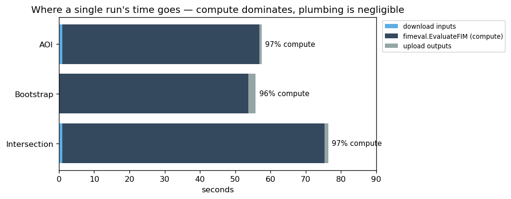
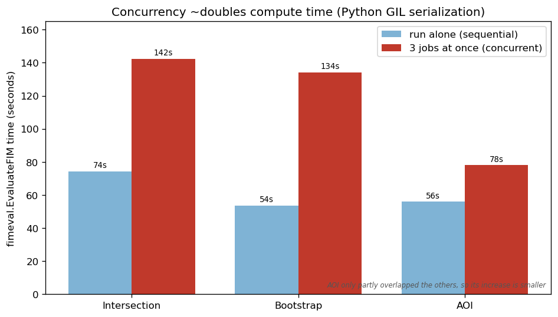
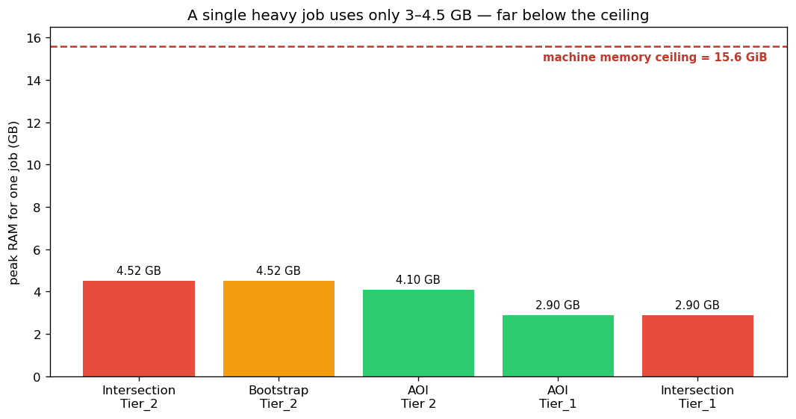

# FIMEVAL-PERF-1 — Profiling Findings

**Question (from the profiling task):** why is the FIMeval GUI *slow*, and why do
the heavy evaluation methods *intermittently fail* (the "coin flip")?

**Answer, in one line:** it is not a Dask or Tethys defect — it is **memory
exhaustion**. The test machine runs out of RAM under concurrent heavy jobs, and
the Linux kernel's out-of-memory killer silently terminates a process (sometimes
the compute worker, sometimes the web server). Both symptoms — slowness *and* the
random failures — trace back to this single cause.

**Date:** 2026-07-07 · **Environment:** WSL2, 15.6 GiB RAM, 8 threads · single
Dask worker · MinIO · fimeval 0.1.6x

---

## 1. Background

The five evaluation methods split cleanly by cost:

- **Light / fast / reliable:** `smallest_extent`, `convex_hull`
- **Heavy / slow / flaky:** `intersected_extent` (Intersection), `bootstrap`, `AOI`

The same heavy methods run fine on a colleague's **Mac**, which has substantially
more RAM. That contrast is the first clue that this is a *resource* problem, not a
code problem.

To isolate the cause we ran a set of experiments that peel away one layer at a
time (raw Dask → Tethys's Dask glue → fimeval alone → fimeval in a plain
notebook), plus code timers in the live app and OS-level memory measurement.

## 2. Method & instrumentation

| Tool | What it measured |
|---|---|
| `[TIMER]` prints in `evaluate_fim.py` (worker) | download / `EvaluateFIM` / upload seconds per run |
| `[TIMER]` prints in `controllers.py` (server) | upload staging, job submit, per-poll status cost |
| `measure_mem.py` under `/usr/bin/time -v` | true peak RAM (RSS) of **one** fimeval job, no Dask/Tethys |
| `dmesg` (kernel log) | out-of-memory kill events |

`measure_mem.py` rebuilds the worker's exact call — rasters in a `case_study`
subdir, `target_crs='EPSG:5070'`, `sub_method='random'` for bootstrap,
`shapefile_dir` for AOI — so the standalone numbers match the app apples-to-apples.

## 3. Findings

### 3.1 Almost all of a run is fimeval compute; the plumbing is negligible

For a single run, download and upload are ~1–2 s each; **~97 % of the wall-clock
is inside `fimeval.EvaluateFIM`**.



| Method | download | `EvaluateFIM` | upload | total | compute share |
|---|--:|--:|--:|--:|--:|
| Intersection | 0.9 s | **74.4 s** | 1.1 s | 76.4 s | 97 % |
| Bootstrap | 0.1 s | **53.6 s** | 2.1 s | 55.8 s | 96 % |
| AOI | 0.9 s | **55.9 s** | 0.7 s | 57.5 s | 97 % |

### 3.2 The app's Dask/Tethys plumbing is not a bottleneck

The status-polling endpoint — which I had suspected — is trivially cheap, even
under load:

| Server-side step | Typical cost |
|---|--:|
| Status poll — new Dask `Client` + `Future` | ~0.02 s |
| Status poll — MinIO marker `list_prefix` | ~0.05 s |
| Job submit (`save` + `execute`) | ~0.03 s |

This rules out the status endpoint / per-poll `Client` creation as a cause.

### 3.3 Concurrency roughly doubles compute time (Python GIL)

Running the three heavy methods at once (vs. one at a time) roughly **doubled**
each job's compute time. Python's Global Interpreter Lock lets only one thread
execute Python at a time, so compute-bound jobs in the single worker process
**take turns** rather than truly running in parallel.



| Method | alone | 3-at-once | slowdown |
|---|--:|--:|--:|
| Intersection | 74.4 s | 142.3 s | 1.9× |
| Bootstrap | 53.6 s | 134.1 s | 2.5× |
| AOI | 55.9 s | 78.0 s | 1.4× \* |

\* AOI only partly overlapped the other two (it started later), so its increase
is smaller.

### 3.4 A single heavy job needs only 3–4.5 GB

Measured peak RAM for one job in isolation (`/usr/bin/time -v`):



| Method · data | peak RSS | peak GB |
|---|--:|--:|
| Intersection · Tier_2 | 4,741,304 KB | 4.52 GB |
| Bootstrap · Tier_2 | 4,743,540 KB | 4.52 GB |
| AOI · For_AOI/Tier 2 | 4,298,952 KB | 4.10 GB |
| AOI · For_AOI/Tier_1 | 3,038,940 KB | 2.90 GB |
| Intersection · Tier_1 | 3,039,368 KB | 2.90 GB |

Note peak RAM tracks the *resampled raster grid*, not file size on disk — the
408 MB Tier_1 benchmark resamples down to a coarse common resolution and actually
uses **less** memory than the smaller Tier_2 inputs. Real-world data with a finer
common resolution (the app's Intersection run worked a 71-million-pixel grid) will
sit at the high end of this range or beyond.

**A single job (3–4.5 GB) is always safe on a 15.6 GiB box.** The danger is
concurrency.

### 3.5 The failure: the kernel OOM-killer, caught in the act

During a parallel run (bootstrap + 2× AOI + intersection across browser tabs) the
**Tethys server "quit on its own"** with no traceback. The Dask worker, meanwhile,
*completed every job*. The kernel log explains why:

```
Out of memory: Killed process 48503 (python3.13)
  total-vm:19312544kB, anon-rss:15035060kB   (≈14.3 GB resident)
oom-kill: ...,global_oom,task=python3.13
```

This pattern repeats across multiple timestamps: a `python3.13` process balloons
to ~15 GB — essentially the whole machine — and the kernel issues **SIGKILL**.
SIGKILL is instantaneous and gives the process no chance to log anything, which is
exactly why the server vanished silently. **Which** process dies is just whichever
is largest at that instant — sometimes the worker, sometimes the web server. That
randomness *is* the coin flip.

### 3.6 Why concurrency crosses the ceiling

The single Dask worker runs all concurrent jobs in **one process / one shared
memory space**. So N heavy jobs ≈ N × (3–4.5 GB), and with the web server also
buffering a large upload, the total crosses 15.6 GiB at around **3–4 concurrent
jobs** — precisely the load that triggered the crash.


### 3.7 Secondary bottleneck — upload staging under load

Separate from the compute path, staging uploads through Django degrades badly
under concurrency (the dev server serializes blocking uploads behind status
polls). This is a throughput issue, not the OOM cause, but it is real:

| Upload | alone | under concurrent load |
|---|--:|--:|
| 1 candidate, no shapefile | 0.5 s | 35.9 s |
| AOI bundle (5 shapefile parts) | 29.3 s | 50–65 s |

## 4. Root cause

> **The machine runs out of RAM.** Each heavy fimeval job needs 3–4.5 GB; the
> single worker process runs concurrent jobs in one shared memory space; a few of
> them (plus the web server) exceed the 15.6 GiB ceiling; the kernel SIGKILLs a
> process without warning.
>
> - **Slowness** = GIL serialization (jobs take turns) + swap thrashing as memory fills.
> - **Intermittent failure ("coin flip")** = OOM kill of whichever process is largest.

It is **not** a Dask flakiness / heartbeat problem, **not** the status endpoint,
and **not** an application bug. The event-loop-unresponsive warnings in the worker
log are a *symptom* of the GIL-holding compute, not the cause of failure.

## 5. The Mac confirms it

The identical software runs reliably on a Mac with more RAM. Same code, same
methods, more memory → no OOM, no coin flip. This is the control that closes the
loop: the app inherits fimeval's memory appetite; give it enough headroom and the
problems disappear.

## 6. Experiment ledger

| Exp | Layers included | Result |
|---|---|---|
| **A** — plain Dask, no Tethys | Dask only, trivial task | Fast, 100 % reliable → Dask core is fine |
| **B** — Tethys DaskJob | Dask + Tethys glue, trivial task | Submit + per-poll status ~cheap → glue is fine |
| **C** — fimeval, no Dask (`measure_mem.py`) | fimeval + reprojection + PWB | 3–4.5 GB/job; the memory cost lives here |
| **D** — notebook / Mac control | fimeval only, more RAM | Runs fine → confirms it's resources, not code |

## 7. Recommendations (summary)

Detailed mitigation design is a **separate follow-up task**; in brief:

1. **Run on a memory-sized cloud box.** Size ≈ (peak per job, ~4.5 GB) ×
   (max concurrent jobs allowed) + headroom. AWS memory-optimized (`r`-family)
   fits this workload.
2. **Isolate the web server from the compute worker** (separate machines/
   containers) so a compute OOM can never take down the web front end — the single
   most valuable structural change.
3. **Bound concurrency and set Dask memory limits** so an overloaded worker
   *pauses/spills* instead of being killed; scale out with more worker boxes rather
   than piling jobs onto one process.
4. *(Secondary)* Move uploads off the Django path (direct-to-MinIO / presigned) —
   addresses §3.7.

---

## Appendix — reproduce

**Peak memory (per job):**
```bash
cd <fimeval-notebook>/FIMeval
conda activate tethys
/usr/bin/time -v python measure_mem.py intersected_extent Tier_2 2>&1 | grep "Maximum resident"
/usr/bin/time -v python measure_mem.py bootstrap          Tier_2 2>&1 | grep "Maximum resident"
/usr/bin/time -v python measure_mem.py AOI               For_AOI/Tier_1 2>&1 | grep "Maximum resident"
/usr/bin/time -v python measure_mem.py intersection      Tier_1 2>&1 | grep "Maximum resident"
# Maximum resident set size (kbytes) ÷ 1048576 = peak GB
```

**Timers (in the live app):** the `[TIMER]` prints on the `perf/timers` branch —
restart both the Tethys server and the Dask worker, run a method, read the worker
and server logs.

**OOM evidence:** `dmesg | grep -iE "out of memory|oom-kill|killed process"`

**Charts:** `python docs/specs/perf-findings-charts.py` (regenerates the four
figures in `docs/specs/img/perf/` from the numbers above).
