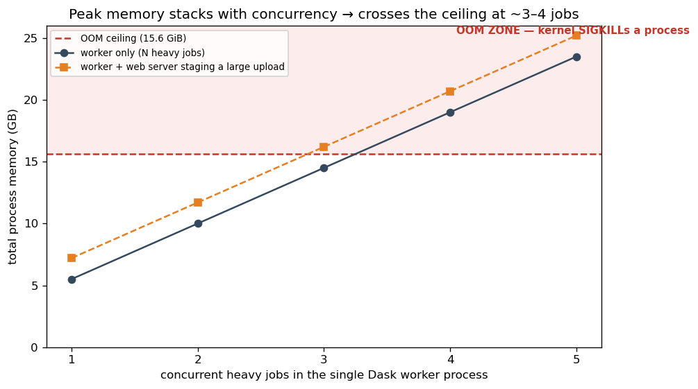
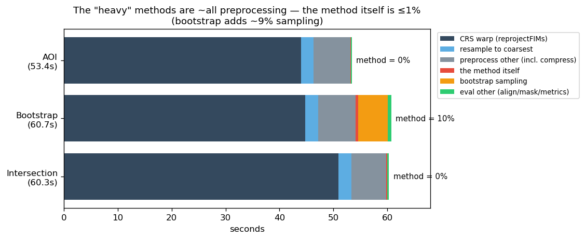
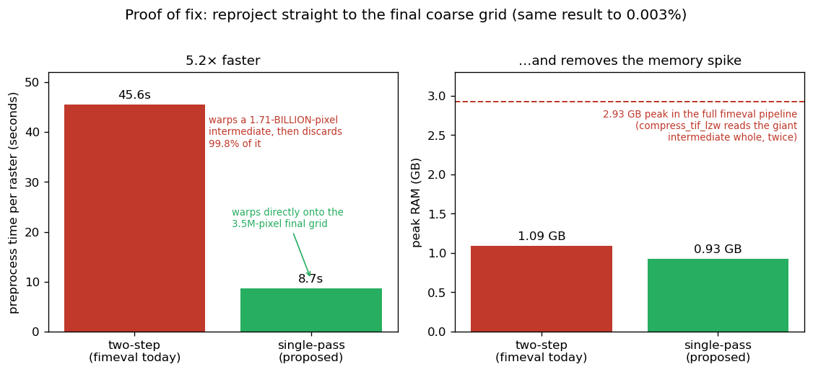
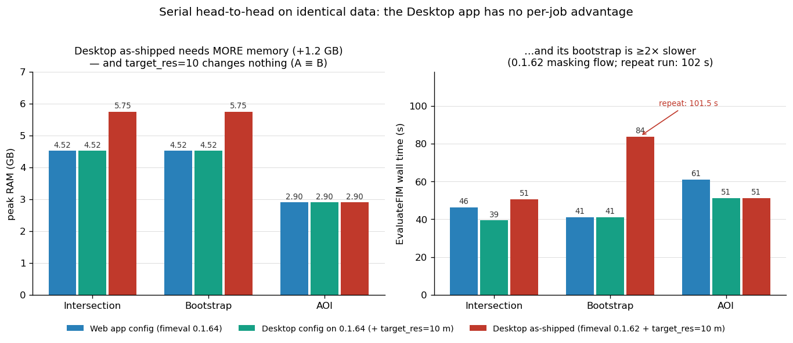
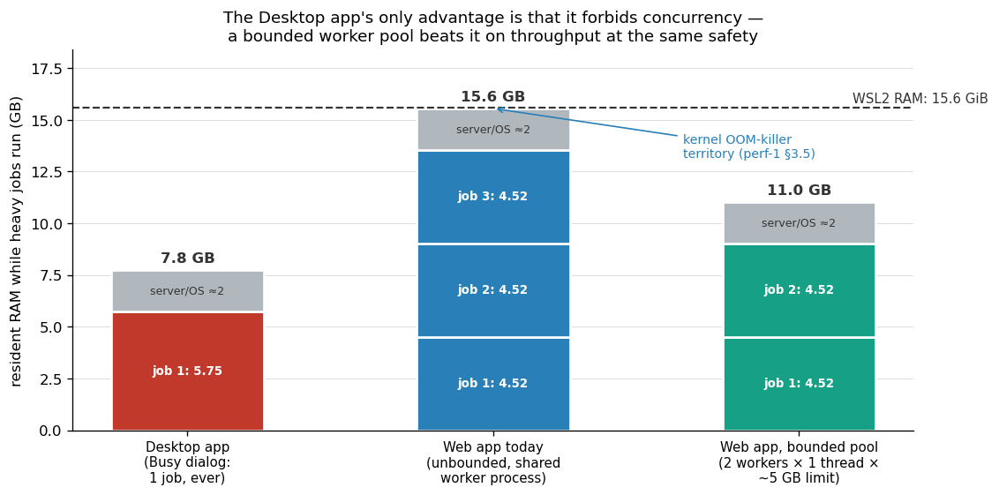

# FIMeval Web App Performance — The Complete Story

*A plain-language summary of three investigations (July 2026), written for
developers and scientists alike. The full technical reports are linked at the
end of each section.*

**TL;DR — Heavy evaluations were randomly crashing the server. The cause was
not a software bug: each heavy evaluation needs 3–4.5 GB of memory, and running
three or more at once exhausted the machine, so the operating system silently
force-quit whatever was using the most. The desktop version of FIMeval never
crashes only because it refuses to run two evaluations at once — not because it
is faster (it is actually slower and heavier). We fixed the web app by running
jobs in a bounded pool: two at a time, everything else waits its turn. And we
found a change to the FIMeval library itself that would make every evaluation
~5× faster and use ~4× less memory — proposed to the FIMeval team.**

---

## 1. The symptom

The five evaluation methods split cleanly into two groups:

- **Light and reliable:** Smallest Extent, Convex Hull — always fast, never fail.
- **Heavy and flaky:** Intersection, Bootstrap, AOI — slow, and when several ran
  at once, the app would sometimes fail with no error message at all. The same
  jobs ran fine on a colleague's Mac.

## 2. The cause: memory, not code

We measured each layer separately (the job system alone, the web plumbing
alone, the FIMeval computation alone) and found the plumbing entirely innocent
— **~97% of every run is the FIMeval computation itself**, and one heavy
evaluation needs **3–4.5 GB of RAM** (working memory).

One at a time, that is always safe. The danger is running several together:
all jobs shared one process, so their memory needs *added up*.



At 3–4 simultaneous heavy jobs the total crossed the machine's 15.6 GB limit.
When a Linux machine runs out of memory, the operating system's emergency
mechanism (the "OOM killer") instantly terminates the largest process — with
no warning and no error message. Sometimes that was the compute worker,
sometimes the web server itself. That is the "random" failure: it wasn't
random software behavior, it was the operating system pulling a plug.

The kernel log caught it in the act:

```
Out of memory: Killed process 48503 (python3.13) … ≈14.3 GB resident
```

*Full report: [perf-profiling-findings.md](perf-profiling-findings.md)*

## 3. Where the computation actually goes — and a 5× fix

Before recommending bigger servers, we asked: can the computation itself be
cheaper? Profiling every phase revealed something surprising: **the "heavy"
methods are not heavy.** The method itself — the intersection geometry, the
AOI clip — is **less than 1%** of the run. Nearly everything is shared
preparation, dominated by one step:



When input maps use different coordinate systems, FIMeval converts them to a
common one ("reprojection") **at their full native detail** — for one test
dataset, an intermediate image of **1.71 billion pixels** — and then
immediately shrinks the result down to the shared coarse grid of **3.5 million
pixels**. 99.8% of that expensive work is thrown away within seconds. A helper
routine also loads that giant intermediate into memory whole (twice), which is
what sets the 3–4.5 GB memory peak.

The standard GIS practice is to convert and shrink **in one pass**, straight
onto the final grid. We measured it on the same data:



*Reading the chart: the bars measure the conversion step **alone** — proof that
the conversion itself streams efficiently (~1 GB). The dashed line is the
**whole pipeline** on the same dataset (~2.9 GB): the gap between bar and line
is the helper routine loading the giant intermediate into memory. The one-pass
fix removes that intermediate, so the whole-pipeline peak falls to roughly the
bar's level.*

| | Today (two steps) | One pass |
|---|--:|--:|
| Time per raster | 45.6 s | **8.7 s (5.2× faster)** |
| Memory — conversion step alone (bars) | 1.09 GB | 0.93 GB |
| Memory — whole pipeline (dashed line) | ~2.9 GB | **~1 GB** (intermediate never exists) |
| Result | — | identical to 0.003% |

(Whole-job peaks vary by dataset — ~2.9 GB on this data, ~4.5 GB on Tier_2's
finer evaluation grid; that spread is the "3–4.5 GB per job" range in §2.)

This change lives in the FIMeval library itself (maintained by the FIMeval
team), so we have proposed it upstream rather than patching it locally. It is
the single biggest lever in the whole system: at ~1 GB per job, the same
machine could safely run 6–8 evaluations at once instead of 2.

*Full report: [fimeval-optimization-findings.md](fimeval-optimization-findings.md)*

## 4. "But the desktop app never crashes" — the comparison

The desktop version of FIMeval (built by the method's designer) runs the same
heavy evaluations without ever failing. Does it know something the web app
doesn't? We profiled both, head-to-head, on identical data:



The desktop app as-shipped is actually **heavier** (5.75 vs 4.52 GB — it
bundles an older FIMeval version) and its Bootstrap runs **2× slower**. Its
reliability comes from exactly one thing: a *"Busy — please wait"* dialog. It
refuses to run more than one evaluation at a time, so its memory use can never
stack. One job at a time is safe on any reasonable laptop — which also
explains the Mac: it was never about the Mac's extra memory.



*Full report: [desktop-app-comparison-findings.md](desktop-app-comparison-findings.md)*

## 5. What we changed

The web app now runs its compute workers as a **bounded pool**: two isolated
processes, each limited to 6 GB, one job each — everything beyond that
**queues** instead of stacking in memory. This keeps the desktop app's safety
while still running two jobs in true parallel (which the desktop app cannot):

```
dask worker tcp://127.0.0.1:8786 --nworkers 2 --nthreads 1 --memory-limit 6GB
```

Verified live: three simultaneous heavy evaluations — the exact load that used
to kill the server — now run two-in-parallel-one-queued, all complete, zero
out-of-memory events.

## 6. What's next

*Agreed at the FIM team meeting (2026-07-16): manage jobs first — queuing and
concurrency limits land before further GUI development — while the source code
is optimized in parallel.*

1. **Concurrency limits made official** *(Nathan Swain)* — the bounded worker
   pool (§5) becomes the standard Dask configuration so simultaneous jobs can
   never exhaust the server again.
2. **Show the queue honestly in the UI, with estimated wait times** *(group)* —
   "Queued — roughly N minutes → Running (elapsed 0:42) → Complete" instead of
   a bare spinner (designed and planned; tickets FIMEVAL-BE16–18, FE13, FE19).
3. **Fair scheduling** *(Reshma Raghavan)* — evaluate Dask job priorities and
   per-user round-robin so one user submitting many jobs cannot starve
   everyone else, and light methods never wait behind heavy ones.
4. **Scaling experiments** *(Reshma Raghavan)* — measure the trade-off between
   adding workers (cost) and queueing (wait time) to pick a balanced setup for
   the current machine and for cloud deployment.
5. **The upstream one-pass fix** (§3) *(Supath Dhital)* — ~5× faster, ~4× less
   memory, for every FIMeval user everywhere, not just this app. The
   confusion-matrix computation over the full domain is the other identified
   hotspot to examine.
6. **Cloud-Optimized GeoTIFFs (exploration)** — tiled rasters would let FIMeval
   read only the region being evaluated instead of whole files, making memory
   use independent of raster size and enabling browser map previews.
7. **Client-side computing (long-term)** — running evaluations directly in the
   user's browser (Pyodide / WebAssembly) would remove server load entirely
   for smaller jobs; parked until the server-side work above is done.

---

### Mini-glossary

- **RAM / memory** — a computer's fast working space; unlike disk storage, it
  is small (this machine: 15.6 GB) and shared by every running program.
- **OOM killer** — the operating system's last-resort response to running out
  of memory: it instantly terminates the largest program, with no error message.
- **Reprojection** — converting a map to a different coordinate system, like
  redrawing it on a differently-curved sheet of paper.
- **Raster** — a map stored as a grid of pixels (here, flood/no-flood cells).
- **Worker / pool / queue** — the programs that run evaluations; a *bounded
  pool* runs a fixed number at once and makes the rest wait in line.
